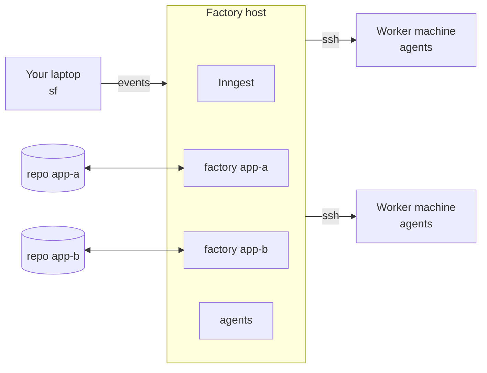

# sf-kit: a self-hosted software factory

A coding agent writes code fast. It also writes slop. It has no judgment, and it sees only the task in front of it. Use one by hand, and your day turns into bug hunts, terminal juggling and live corrections.

Those are engineering problems, and they have engineering answers. sf-kit is a software factory that you run on your own machines. It follows Matt Pocock's course [Software Factories for Real Engineers](https://www.aihero.dev/cohorts/software-factories-for-real-engineers-xdy1m). The course takes practices that work for large human teams, like domain language, deep modules and code review, and applies them to agents.

You do the part that needs a person. `sf` plans each idea with you until you agree on the design. Then it writes the spec and the tickets and gives them to the factory. Agents build the tickets in Docker containers, and a second agent reviews each PR. You return to PRs that are ready for your review, and you merge.

| Agents by hand | Agents in sf-kit |
| --- | --- |
| You find the bugs in every diff. | A review agent reads each PR against its ticket and your coding standards first. |
| You watch terminals and steer the agent live. | Agents work in the background. `sf` stops only when a PR is ready, a ticket needs a decision, a prototype is ready or a run failed. |
| You run one task at a time. | Many agents work at the same time, across your repos and your machines. |
| Your time goes to bug fixes. | Your time goes to the plan and the decisions. |


```mermaid
flowchart LR
    idea([Your idea]) --> sf["sf<br/>plan with you"]
    sf --> gh[("GitHub<br/>spec, tickets")]
    gh -- "labels, comments" --> orch["Orchestrator<br/>+ Inngest"]
    orch -- "starts" --> runner["Runner containers<br/>Claude Code agents"]
    runner -- "commits" --> orch
    orch -- "branches, PRs,<br/>comments" --> gh
    gh -- "PR ready" --> you([You review<br/>and merge])
```

## Brakes and accelerators

The brakes build your trust in the agents:

- **You plan first.** Grilling asks you questions until you and the agent share one design. The spec and the tickets carry that design to every agent.
- **A second agent reviews each PR.** It checks the PR against its ticket and your coding standards. It never approves. Only you merge.
- **Each commit runs your checks.** A pre-commit hook runs the check of the project in every agent clone. CI runs the full check.
- **Agents stay in a box.** They run without the GitHub token, behind a firewall, and follow only issues from collaborators. See [Security](docs/security.md).

The accelerators push more code through:

- **Explore mode** gives each ticket its own agent and its own PR.
- **The night shift** builds all tickets of a spec in parallel and opens one PR.
- **Scheduled tasks** fix lint failures, rebase PRs whose base moved, and file architecture tickets.
- **Many repos and many machines.** One host serves all your repos, and worker machines add agent slots. See the next section.

## Many repos, many machines


```mermaid
flowchart LR
    laptop["Your laptop<br/>sf"] -- "events" --> host
    subgraph host ["Factory host"]
        inngest["Inngest"]
        fa["factory app-a"]
        fb["factory app-b"]
        local["agents"]
    end
    ga[("repo app-a")] <--> fa
    gb[("repo app-b")] <--> fb
    host -- "ssh" --> w1["Worker machine<br/>agents"]
    host -- "ssh" --> w2["Worker machine<br/>agents"]
```

**One factory for each repo.** A factory host runs one factory for each of your repos. Each factory has its own name, port, GitHub token and event names. All factories share one Inngest server, one runner image and the agent slots. To add a repo, run `./setup-wizard.sh --repo owner/name`.

**Agents on several machines.** `FACTORY_MACHINES` lists the machines that run agents, with a slot count for each:

```bash
FACTORY_MACHINES="local=2 ssh://factory@linux-box=3"
```

Each run picks the machine with the smallest share of busy slots, and keeps it to the end. The host reaches each worker machine over ssh. A worker machine holds no factory config. To add one, run `init-worker.sh` on it. The runner image builds on amd64 and arm64.

**`sf` from any machine.** `sf` can drive factories on other hosts. Put their addresses in `~/.config/sf`, and one laptop drives factories on several hosts. Each repo still has exactly one factory host.

[Set up a factory host](docs/setup.md) has the details: [one factory per repo](docs/setup.md#one-factory-per-repo), [worker machines](docs/setup.md#worker-machines) and [`sf` on another machine](docs/setup.md#sf-on-another-machine).

## Quick start

```bash
# 1. Prepare the factory host, once. The dry run shows each change first.
./init-host.sh --observability phoenix --dry-run
./init-host.sh --observability phoenix

# 2. Add a factory for each repo.
./setup-wizard.sh

# Optional: on each worker machine, then add it to FACTORY_MACHINES.
# ./init-worker.sh --key "$(ssh <factory host> cat .ssh/id_ed25519.pub)" --dry-run

# 3. Put sf on your PATH.
ln -s "$PWD/sf" ~/.local/bin/sf

# 4a. Start a new project.
cd ~/code && sf new my-app "<what you want to build>"

# 4b. Or prepare an existing project. Add --dry-run first to see the changes.
./init-project.sh --path ~/code/my-app --labels
(cd ~/code/my-app && npm i -D @ai-hero/sandcastle@^0.14 tsx zod@^3.25)
cd ~/code/my-app && sf idea "<what you want to build>"
```

Each script prints its next steps at the end. Run the scripts as your own user, not with `sudo`.

## Read next

| Doc | Read it when you want to |
| --- | --- |
| [Set up a factory host](docs/setup.md) | install the host, add repos, add worker machines, use `sf` from a laptop, or open the dashboards |
| [Use `sf`](docs/sf.md) | plan an idea, start the build, read the board, or follow one agent |
| [What the factory runs](docs/factory.md) | know what each label starts and what each task does |
| [Security](docs/security.md) | know what an agent can reach and whose issues it follows |

## What is in this folder

| Path | What it does |
| --- | --- |
| `sf` (`cli/sf.mjs`) | The pipeline CLI. It takes an idea from planning to merged pull requests, and shows the runs and the agents. |
| `init-host.sh` | Prepares the factory host once. It installs Inngest, Postgres, Redis, optional Phoenix, the run network, the firewall rules and the runner image. It starts no factory. |
| `setup-wizard.sh` | Adds or edits one factory. Run it once for each repo. |
| `init-worker.sh` | Makes a machine a worker machine. A worker machine runs agents for a factory host. |
| `init-project.sh` | Makes a project ready for the factory. It never overwrites a file. |
| `orchestrator/` | The Node app. It turns GitHub events into Inngest events, and its functions run the agents in Docker. |
| `host/` | The compose file, the runner Dockerfile, the Caddyfile, the firewall script and the systemd units. |
| `project-template/` | The files that `init-project.sh` copies into a project. |
| `herdr-plugin/` | An optional [herdr](https://herdr.dev) plugin. It opens a pane that follows one agent. |
